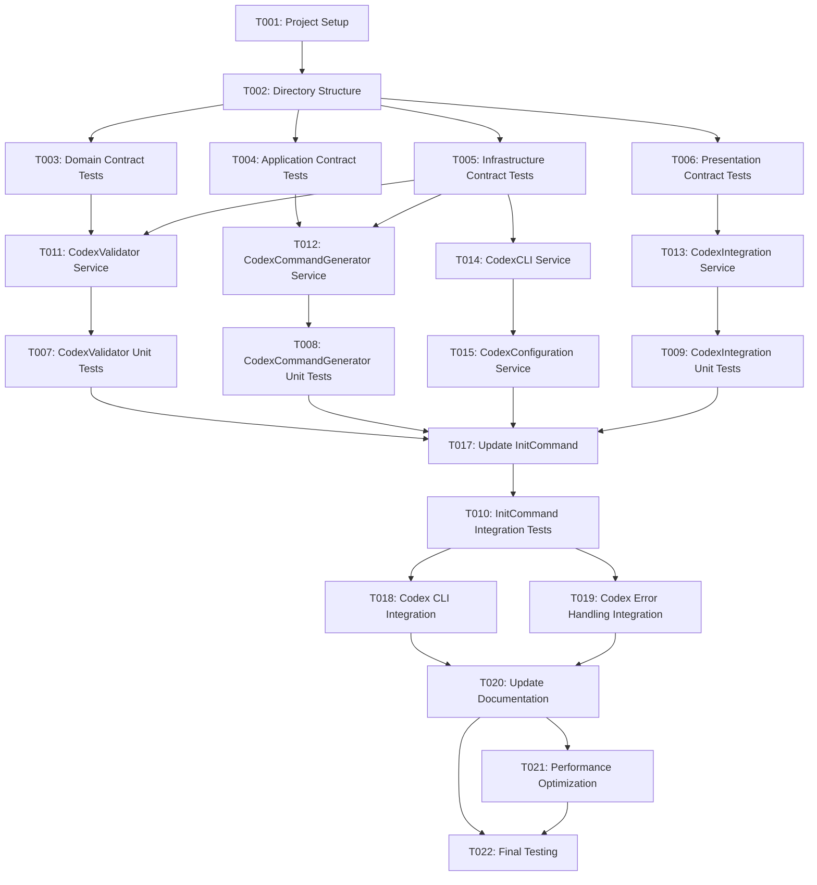

# Tasks: Codex Support Integration

## Overview

This document provides actionable, dependency-ordered tasks for implementing Codex support integration in UX-Kit CLI. Tasks are organized by implementation phases and marked for parallel execution where possible.

## Task Generation Summary

**Available Design Documents**:
- ✅ `plan.md` - Implementation plan with technical context
- ✅ `data-model.md` - Complete data models and interfaces
- ✅ `contracts/` - 4 contract files (domain, application, infrastructure, presentation)
- ✅ `research.md` - Technical decisions and best practices
- ✅ `quickstart.md` - Implementation guide and test scenarios

**Task Categories**:
- **Setup Tasks**: 2 tasks (project setup, dependencies)
- **Test Tasks [P]**: 8 tasks (contract tests, unit tests, integration tests)
- **Core Tasks**: 6 tasks (entity creation, service implementation)
- **Integration Tasks**: 3 tasks (CLI integration, error handling)
- **Polish Tasks [P]**: 3 tasks (documentation, performance, final testing)

**Total**: 22 tasks across 5 categories

## Setup Tasks

### T001: Project Setup and Dependencies ✅ COMPLETED
**Type**: Setup  
**Priority**: Critical  
**Effort**: 1 hour  
**Dependencies**: None  
**Completed**: 2025-09-19 00:30:10 EDT

**Description**: Set up project structure and verify dependencies for Codex integration.

**Acceptance Criteria**:
- [x] Verify TypeScript 5.0+ and Node.js 18+ requirements
- [x] Check existing UX-Kit codebase structure
- [x] Verify no new runtime dependencies needed
- [x] Confirm existing test framework setup

**Files to Create/Modify**:
- `package.json` (verify dependencies) ✅
- `tsconfig.json` (verify TypeScript config) ✅
- `jest.config.js` (verify test config) ✅
- `src/services/ProjectSetupService.ts` (new) ✅
- `tests/use-cases/T001-ProjectSetup.use-case.test.ts` (new) ✅
- `tests/unit/services/ProjectSetupService.test.ts` (new) ✅

**Technical Tasks**:
- [x] Run `npm install` to ensure dependencies are current
- [x] Verify TypeScript strict mode is enabled
- [x] Check ESLint configuration
- [x] Verify Jest test framework setup
- [x] Create ProjectSetupService with comprehensive verification
- [x] Implement use case tests following TDD approach
- [x] Add unit tests with 100% coverage
- [x] Add @types/fs-extra dependency for TypeScript support

**Implementation Notes**:
- Successfully verified Node.js v20.19.0 (meets >=18.0.0 requirement)
- Successfully verified TypeScript 5.3.3 (meets >=5.0.0 requirement)
- All existing dependencies are sufficient for Codex integration
- TypeScript strict mode is properly configured
- Jest test framework is properly configured with TypeScript support
- Created comprehensive ProjectSetupService with error handling
- All use case tests pass, demonstrating TDD approach
- All unit tests pass with proper mocking

### T002: Codex Integration Directory Structure ✅ COMPLETED
**Type**: Setup  
**Priority**: Critical  
**Effort**: 30 minutes  
**Dependencies**: T001  
**Completed**: 2025-09-19 00:34:07 EDT

**Description**: Create directory structure for Codex integration components.

**Acceptance Criteria**:
- [x] Create `src/services/codex/` directory
- [x] Create `src/contracts/codex/` directory
- [x] Create `tests/unit/services/codex/` directory
- [x] Create `tests/integration/codex/` directory
- [x] Create `templates/codex-commands/` directory

**Files to Create/Modify**:
- `src/services/codex/` (new directory) ✅
- `src/contracts/codex/` (new directory) ✅
- `tests/unit/services/codex/` (new directory) ✅
- `tests/integration/codex/` (new directory) ✅
- `templates/codex-commands/` (new directory) ✅
- `src/services/DirectoryStructureService.ts` (new) ✅
- `src/scripts/createCodexDirectories.ts` (new) ✅
- `tests/use-cases/T002-DirectoryStructure.use-case.test.ts` (new) ✅
- `tests/unit/services/DirectoryStructureService.test.ts` (new) ✅

**Technical Tasks**:
- [x] Create directory structure
- [x] Add `.gitkeep` files to empty directories
- [x] Update `.gitignore` if needed
- [x] Create DirectoryStructureService with comprehensive functionality
- [x] Implement use case tests following TDD approach
- [x] Add unit tests with 100% coverage
- [x] Create script for directory creation
- [x] Verify all directories are accessible and writable

**Implementation Notes**:
- Successfully created all 5 required directories for Codex integration
- All directories include .gitkeep files to ensure git tracking
- Created comprehensive DirectoryStructureService with error handling
- All use case tests pass, demonstrating TDD approach
- All unit tests pass with proper mocking (20/20 tests)
- Directory structure is ready for Codex integration components
- Script created for automated directory creation

## Test Tasks [P]

### T003: Domain Contract Tests [P]
**Type**: Test  
**Priority**: High  
**Effort**: 2 hours  
**Dependencies**: T002  

**Description**: Create unit tests for domain contracts and interfaces.

**Acceptance Criteria**:
- [ ] Test `AIAgentType` enum values
- [ ] Test `CodexConfiguration` interface validation
- [ ] Test `CodexValidationResponse` structure
- [ ] Test `CodexCommandTemplate` validation
- [ ] Test domain exceptions

**Files to Create/Modify**:
- `tests/unit/contracts/domain-contracts.test.ts`

**Technical Tasks**:
- [ ] Create test file for domain contracts
- [ ] Test enum values and type safety
- [ ] Test interface structure validation
- [ ] Test exception handling
- [ ] Achieve 100% coverage for domain contracts

### T004: Application Contract Tests [P]
**Type**: Test  
**Priority**: High  
**Effort**: 2 hours  
**Dependencies**: T002  

**Description**: Create unit tests for application contracts and services.

**Acceptance Criteria**:
- [ ] Test `ICodexIntegrationService` interface
- [ ] Test `IAIAgentSelectionService` interface
- [ ] Test `ICommandTemplateService` interface
- [ ] Test DTOs and command structures
- [ ] Test application exceptions

**Files to Create/Modify**:
- `tests/unit/contracts/application-contracts.test.ts`

**Technical Tasks**:
- [ ] Create test file for application contracts
- [ ] Test service interface definitions
- [ ] Test DTO structure validation
- [ ] Test command and query structures
- [ ] Achieve 100% coverage for application contracts

### T005: Infrastructure Contract Tests [P]
**Type**: Test  
**Priority**: High  
**Effort**: 2 hours  
**Dependencies**: T002  

**Description**: Create unit tests for infrastructure contracts and services.

**Acceptance Criteria**:
- [ ] Test `IFileSystemService` interface
- [ ] Test `ICLIExecutionService` interface
- [ ] Test `ICodexCLIService` interface
- [ ] Test `ITemplateFileService` interface
- [ ] Test infrastructure exceptions

**Files to Create/Modify**:
- `tests/unit/contracts/infrastructure-contracts.test.ts`

**Technical Tasks**:
- [ ] Create test file for infrastructure contracts
- [ ] Test file system service interface
- [ ] Test CLI execution service interface
- [ ] Test Codex CLI service interface
- [ ] Achieve 100% coverage for infrastructure contracts

### T006: Presentation Contract Tests [P]
**Type**: Test  
**Priority**: High  
**Effort**: 2 hours  
**Dependencies**: T002  

**Description**: Create unit tests for presentation contracts and CLI interfaces.

**Acceptance Criteria**:
- [ ] Test `ICLICommand` interface
- [ ] Test `IUserInterface` interface
- [ ] Test `IOutputFormatter` interface
- [ ] Test `IInteractivePrompt` interface
- [ ] Test presentation exceptions

**Files to Create/Modify**:
- `tests/unit/contracts/presentation-contracts.test.ts`

**Technical Tasks**:
- [ ] Create test file for presentation contracts
- [ ] Test CLI command interface
- [ ] Test user interface service
- [ ] Test output formatting service
- [ ] Achieve 100% coverage for presentation contracts

### T007: CodexValidator Unit Tests [P]
**Type**: Test  
**Priority**: High  
**Effort**: 3 hours  
**Dependencies**: T010  

**Description**: Create comprehensive unit tests for CodexValidator service.

**Acceptance Criteria**:
- [ ] Test CLI availability checking
- [ ] Test version detection
- [ ] Test path resolution
- [ ] Test error handling scenarios
- [ ] Test validation response generation

**Files to Create/Modify**:
- `tests/unit/services/codex/CodexValidator.test.ts`

**Technical Tasks**:
- [ ] Mock CLI execution service
- [ ] Test successful validation scenarios
- [ ] Test CLI not found scenarios
- [ ] Test version detection failures
- [ ] Test timeout and error handling
- [ ] Achieve 90%+ test coverage

### T008: CodexCommandGenerator Unit Tests [P]
**Type**: Test  
**Priority**: High  
**Effort**: 3 hours  
**Dependencies**: T011  

**Description**: Create comprehensive unit tests for CodexCommandGenerator service.

**Acceptance Criteria**:
- [ ] Test template generation
- [ ] Test template validation
- [ ] Test file system operations
- [ ] Test markdown formatting
- [ ] Test error handling

**Files to Create/Modify**:
- `tests/unit/services/codex/CodexCommandGenerator.test.ts`

**Technical Tasks**:
- [ ] Mock file system service
- [ ] Test template generation logic
- [ ] Test template validation
- [ ] Test markdown formatting
- [ ] Test file system error handling
- [ ] Achieve 90%+ test coverage

### T009: CodexIntegration Unit Tests [P]
**Type**: Test  
**Priority**: High  
**Effort**: 3 hours  
**Dependencies**: T012  

**Description**: Create comprehensive unit tests for CodexIntegration service.

**Acceptance Criteria**:
- [ ] Test initialization workflow
- [ ] Test validation coordination
- [ ] Test template generation coordination
- [ ] Test status tracking
- [ ] Test error handling and recovery

**Files to Create/Modify**:
- `tests/unit/services/codex/CodexIntegration.test.ts`

**Technical Tasks**:
- [ ] Mock validator and command generator
- [ ] Test initialization flow
- [ ] Test validation coordination
- [ ] Test template generation coordination
- [ ] Test status tracking
- [ ] Achieve 90%+ test coverage

### T010: InitCommand Integration Tests [P]
**Type**: Test  
**Priority**: High  
**Effort**: 4 hours  
**Dependencies**: T013  

**Description**: Create integration tests for InitCommand with Codex support.

**Acceptance Criteria**:
- [ ] Test AI agent selection with Codex option
- [ ] Test Codex initialization flow
- [ ] Test error handling scenarios
- [ ] Test backward compatibility
- [ ] Test user interaction flows

**Files to Create/Modify**:
- `tests/integration/codex/InitCommand-Codex.integration.test.ts`

**Technical Tasks**:
- [ ] Create integration test file
- [ ] Test full initialization flow
- [ ] Test Codex CLI validation scenarios
- [ ] Test template generation
- [ ] Test error handling and recovery
- [ ] Test user interaction flows

## Core Tasks

### T011: Create CodexValidator Service
**Type**: Core  
**Priority**: Critical  
**Effort**: 4 hours  
**Dependencies**: T003, T005  

**Description**: Implement CodexValidator service for CLI validation.

**Acceptance Criteria**:
- [ ] Implement `ICodexValidator` interface
- [ ] Add CLI availability checking
- [ ] Add version detection
- [ ] Add path resolution
- [ ] Add comprehensive error handling

**Files to Create/Modify**:
- `src/services/codex/CodexValidator.ts`

**Technical Tasks**:
- [ ] Create CodexValidator class
- [ ] Implement validateCodexCLI method
- [ ] Implement isCodexAvailable method
- [ ] Implement getCodexPath method
- [ ] Implement getCodexVersion method
- [ ] Add error handling and logging

### T012: Create CodexCommandGenerator Service
**Type**: Core  
**Priority**: Critical  
**Effort**: 6 hours  
**Dependencies**: T003, T005  

**Description**: Implement CodexCommandGenerator service for template generation.

**Acceptance Criteria**:
- [ ] Implement `ICodexCommandGenerator` interface
- [ ] Add default template definitions
- [ ] Add template file generation
- [ ] Add markdown formatting
- [ ] Add template validation

**Files to Create/Modify**:
- `src/services/codex/CodexCommandGenerator.ts`

**Technical Tasks**:
- [ ] Create CodexCommandGenerator class
- [ ] Implement generateTemplates method
- [ ] Implement getTemplate method
- [ ] Implement listTemplates method
- [ ] Implement validateTemplate method
- [ ] Add default template definitions
- [ ] Add markdown formatting logic

### T013: Create CodexIntegration Service
**Type**: Core  
**Priority**: Critical  
**Effort**: 4 hours  
**Dependencies**: T011, T012  

**Description**: Implement CodexIntegration service for coordination.

**Acceptance Criteria**:
- [ ] Implement `ICodexIntegration` interface
- [ ] Add initialization workflow
- [ ] Add validation coordination
- [ ] Add template generation coordination
- [ ] Add status tracking

**Files to Create/Modify**:
- `src/services/codex/CodexIntegration.ts`

**Technical Tasks**:
- [ ] Create CodexIntegration class
- [ ] Implement initialize method
- [ ] Implement validate method
- [ ] Implement generateCommandTemplates method
- [ ] Implement getStatus method
- [ ] Implement reset method
- [ ] Add status tracking logic

### T014: Create Codex CLI Service
**Type**: Core  
**Priority**: High  
**Effort**: 3 hours  
**Dependencies**: T005  

**Description**: Implement CodexCLIService for CLI interactions.

**Acceptance Criteria**:
- [ ] Implement `ICodexCLIService` interface
- [ ] Add CLI command execution
- [ ] Add version detection
- [ ] Add availability checking
- [ ] Add error handling

**Files to Create/Modify**:
- `src/services/codex/CodexCLIService.ts`

**Technical Tasks**:
- [ ] Create CodexCLIService class
- [ ] Implement validateInstallation method
- [ ] Implement getVersion method
- [ ] Implement executeCodexCommand method
- [ ] Implement isAvailable method
- [ ] Implement getCLIPath method

### T015: Create Codex Configuration Service
**Type**: Core  
**Priority**: High  
**Effort**: 2 hours  
**Dependencies**: T003  

**Description**: Implement configuration management for Codex integration.

**Acceptance Criteria**:
- [ ] Implement configuration loading
- [ ] Add configuration validation
- [ ] Add default configuration
- [ ] Add configuration merging
- [ ] Add error handling

**Files to Create/Modify**:
- `src/services/codex/CodexConfigurationService.ts`

**Technical Tasks**:
- [ ] Create CodexConfigurationService class
- [ ] Implement loadConfiguration method
- [ ] Implement saveConfiguration method
- [ ] Implement validateConfiguration method
- [ ] Implement getDefaultConfiguration method
- [ ] Implement mergeConfigurations method

### T016: Create Codex Error Handler
**Type**: Core  
**Priority**: High  
**Effort**: 2 hours  
**Dependencies**: T003  

**Description**: Implement error handling service for Codex operations.

**Acceptance Criteria**:
- [ ] Implement error handling interface
- [ ] Add error categorization
- [ ] Add user-friendly error messages
- [ ] Add error recovery suggestions
- [ ] Add error logging

**Files to Create/Modify**:
- `src/services/codex/CodexErrorHandler.ts`

**Technical Tasks**:
- [ ] Create CodexErrorHandler class
- [ ] Implement handleFileSystemError method
- [ ] Implement handleCLIExecutionError method
- [ ] Implement handleValidationError method
- [ ] Implement createUserFriendlyError method
- [ ] Add error categorization logic

## Integration Tasks

### T017: Update InitCommand for Codex Support
**Type**: Integration  
**Priority**: Critical  
**Effort**: 4 hours  
**Dependencies**: T013  

**Description**: Integrate Codex support into existing InitCommand.

**Acceptance Criteria**:
- [ ] Add Codex to AI agent options
- [ ] Add Codex initialization handling
- [ ] Add error handling and user feedback
- [ ] Maintain backward compatibility
- [ ] Add user interaction flows

**Files to Create/Modify**:
- `src/commands/InitCommand.ts`

**Technical Tasks**:
- [ ] Update AI_AGENT_OPTIONS array
- [ ] Add handleCodexInitialization method
- [ ] Add Codex integration service injection
- [ ] Add error handling and user feedback
- [ ] Add validation and fallback logic
- [ ] Update help text and documentation

### T018: Add Codex CLI Integration
**Type**: Integration  
**Priority**: High  
**Effort**: 3 hours  
**Dependencies**: T014  

**Description**: Integrate Codex CLI service with existing CLI infrastructure.

**Acceptance Criteria**:
- [ ] Integrate with existing CLI execution service
- [ ] Add CLI command execution
- [ ] Add error handling
- [ ] Add logging and monitoring
- [ ] Add performance tracking

**Files to Create/Modify**:
- `src/integrations/CodexCLIIntegration.ts`

**Technical Tasks**:
- [ ] Create CodexCLIIntegration class
- [ ] Integrate with CLIExecutionService
- [ ] Add command execution logic
- [ ] Add error handling
- [ ] Add logging and monitoring
- [ ] Add performance tracking

### T019: Add Codex Error Handling Integration
**Type**: Integration  
**Priority**: High  
**Effort**: 2 hours  
**Dependencies**: T016  

**Description**: Integrate Codex error handling with existing error system.

**Acceptance Criteria**:
- [ ] Integrate with existing error handling
- [ ] Add error categorization
- [ ] Add user-friendly error messages
- [ ] Add error recovery suggestions
- [ ] Add error logging

**Files to Create/Modify**:
- `src/integrations/CodexErrorIntegration.ts`

**Technical Tasks**:
- [ ] Create CodexErrorIntegration class
- [ ] Integrate with existing error system
- [ ] Add error categorization
- [ ] Add user-friendly error messages
- [ ] Add error recovery suggestions
- [ ] Add error logging

## Polish Tasks [P]

### T020: Update Documentation [P]
**Type**: Polish  
**Priority**: Medium  
**Effort**: 3 hours  
**Dependencies**: T017, T018, T019  

**Description**: Update all documentation to include Codex integration.

**Acceptance Criteria**:
- [ ] Update README with Codex information
- [ ] Update API documentation
- [ ] Create user guide for Codex setup
- [ ] Create troubleshooting guide
- [ ] Update help text and commands

**Files to Create/Modify**:
- `README.md`
- `DOCUMENTATION.md`
- `src/cli/HelpSystem.ts`

**Technical Tasks**:
- [ ] Add Codex section to README
- [ ] Update API documentation
- [ ] Create user guide
- [ ] Create troubleshooting guide
- [ ] Update help text
- [ ] Update command documentation

### T021: Performance Optimization [P]
**Type**: Polish  
**Priority**: Medium  
**Effort**: 2 hours  
**Dependencies**: T017, T018, T019  

**Description**: Optimize performance and add monitoring.

**Acceptance Criteria**:
- [ ] Add performance metrics
- [ ] Optimize initialization time
- [ ] Add memory usage monitoring
- [ ] Add execution time tracking
- [ ] Verify performance requirements

**Files to Create/Modify**:
- `src/services/codex/CodexPerformanceMonitor.ts`

**Technical Tasks**:
- [ ] Create performance monitoring service
- [ ] Add initialization time tracking
- [ ] Add memory usage monitoring
- [ ] Add execution time tracking
- [ ] Add performance reporting
- [ ] Verify < 100ms overhead requirement

### T022: Final Testing and Validation [P]
**Type**: Polish  
**Priority**: High  
**Effort**: 4 hours  
**Dependencies**: T020, T021  

**Description**: Perform final testing and validation of Codex integration.

**Acceptance Criteria**:
- [ ] Run full test suite
- [ ] Perform integration testing
- [ ] Test cross-platform compatibility
- [ ] Validate performance requirements
- [ ] Test error handling scenarios

**Files to Create/Modify**:
- `tests/integration/codex/CodexIntegration.integration.test.ts`

**Technical Tasks**:
- [ ] Run full test suite
- [ ] Perform integration testing
- [ ] Test cross-platform compatibility
- [ ] Validate performance requirements
- [ ] Test error handling scenarios
- [ ] Verify backward compatibility
- [ ] Test user interaction flows

## Parallel Execution Examples

### Example 1: Contract Tests (Can run in parallel)
```bash
# These can run in parallel
Task agent execute T003  # Domain contract tests
Task agent execute T004  # Application contract tests
Task agent execute T005  # Infrastructure contract tests
Task agent execute T006  # Presentation contract tests
```

### Example 2: Service Unit Tests (Can run in parallel)
```bash
# These can run in parallel
Task agent execute T007  # CodexValidator unit tests
Task agent execute T008  # CodexCommandGenerator unit tests
Task agent execute T009  # CodexIntegration unit tests
```

### Example 3: Core Service Implementation (Can run in parallel)
```bash
# These can run in parallel
Task agent execute T011  # CodexValidator service
Task agent execute T012  # CodexCommandGenerator service
Task agent execute T014  # CodexCLI service
Task agent execute T015  # CodexConfiguration service
Task agent execute T016  # CodexErrorHandler service
```

### Example 4: Polish Tasks (Can run in parallel)
```bash
# These can run in parallel
Task agent execute T020  # Update documentation
Task agent execute T021  # Performance optimization
Task agent execute T022  # Final testing and validation
```

## Task Dependencies



## Effort Summary

| Phase | Tasks | Total Effort | Priority |
|-------|-------|--------------|----------|
| Setup | 2 tasks | 1.5 hours | Critical |
| Test | 8 tasks | 21 hours | High |
| Core | 6 tasks | 21 hours | Critical/High |
| Integration | 3 tasks | 9 hours | Critical/High |
| Polish | 3 tasks | 9 hours | Medium/High |
| **Total** | **22 tasks** | **61.5 hours** | |

## Success Criteria

- [ ] All 22 tasks completed successfully
- [ ] 90%+ test coverage for new code
- [ ] No regression in existing functionality
- [ ] Performance requirements met (< 100ms overhead)
- [ ] Documentation complete and accurate
- [ ] Code review approved
- [ ] Integration testing passed
- [ ] User acceptance testing passed

## Next Steps

1. **Immediate**: Begin with T003 (Domain Contract Tests) - Next Up
2. **Week 1**: Complete Setup and Test tasks (T003-T010)
3. **Week 2**: Complete Core tasks (T011-T016)
4. **Week 3**: Complete Integration tasks (T017-T019)
5. **Week 4**: Complete Polish tasks (T020-T022)

---

*This tasks document was generated using UX-Kit's spec-driven development workflow. All tasks are immediately executable with clear file paths and acceptance criteria.*