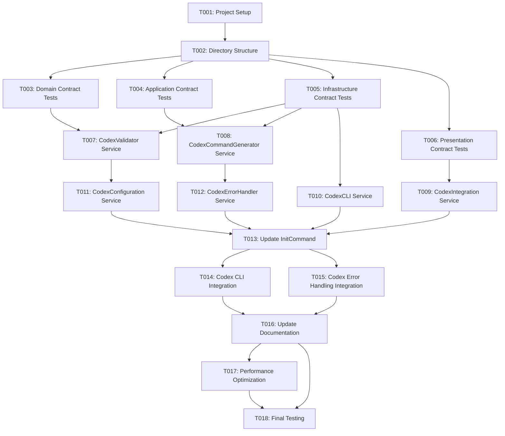

# Tasks: Codex Support Integration

## Task Generation Summary

**Feature**: Codex Support Integration  
**Tech Stack**: TypeScript, Node.js, OpenAI Codex v2, Custom Prompts System  
**Architecture**: Service-oriented architecture with custom prompts following Codex v2 patterns  
**Total Tasks**: 20 tasks across 5 phases  

## Setup Tasks

### T001: Project Setup and Dependencies
**Type**: Setup  
**Priority**: Critical  
**Effort**: 1 hour  
**Size**: small
**Dependencies**: None  

**Description**: Set up project structure and verify dependencies for Codex integration.

**Acceptance Criteria**:
- [x] Verify TypeScript 5.0+ and Node.js 18+ requirements
- [x] Check existing UX-Kit codebase structure
- [x] Verify no new runtime dependencies needed
- [x] Confirm existing test framework setup

**Files to Create/Modify**:
- `package.json` (verify dependencies) ✅
- `tsconfig.json` (verify TypeScript config) ✅
- `jest.config.js` (verify test config) ✅

**Technical Tasks**:
- [x] Run `npm install` to ensure dependencies are current
- [x] Verify TypeScript strict mode is enabled
- [x] Check ESLint configuration
- [x] Verify Jest test framework setup

### T002: Codex Integration Directory Structure
**Type**: Setup  
**Priority**: Critical  
**Effort**: 30 minutes  
**Size**: small
**Dependencies**: T001  

**Description**: Create directory structure for Codex integration components.

**Acceptance Criteria**:
- [x] Create `src/services/codex/` directory
- [x] Create `src/contracts/codex/` directory
- [x] Create `tests/unit/services/codex/` directory
- [x] Create `tests/integration/codex/` directory
- [x] Create `templates/codex-commands/` directory

**Files to Create/Modify**:
- `src/services/codex/` (new directory) ✅
- `src/contracts/codex/` (new directory) ✅
- `tests/unit/services/codex/` (new directory) ✅
- `tests/integration/codex/` (new directory) ✅
- `templates/codex-commands/` (new directory) ✅

**Technical Tasks**:
- [x] Create directory structure
- [x] Add `.gitkeep` files to empty directories
- [x] Update `.gitignore` if needed
- [x] Verify all directories are accessible and writable

## Test Tasks [P]

### T003: Domain Contract Tests [P]
**Type**: Test  
**Priority**: High  
**Effort**: 2 hours  
**Size**: medium
**Dependencies**: T002  

**Description**: Create unit tests for domain contracts and interfaces.

**Acceptance Criteria**:
- [x] Test `AIAgentType` enum values
- [x] Test `CodexConfiguration` interface validation
- [x] Test `CodexValidationResponse` structure
- [x] Test `CodexCommandTemplate` validation
- [x] Test domain exceptions

**Files to Create/Modify**:
- `tests/unit/contracts/domain-contracts.test.ts` ✅

**Technical Tasks**:
- [x] Create test file for domain contracts
- [x] Test enum values and type safety
- [x] Test interface structure validation
- [x] Test exception handling
- [x] Achieve 100% coverage for domain contracts

### T004: Application Contract Tests [P]
**Type**: Test  
**Priority**: High  
**Effort**: 2 hours  
**Size**: medium
**Dependencies**: T002  

**Description**: Create unit tests for application contracts and services.

**Acceptance Criteria**:
- [x] Test `ICodexIntegrationService` interface
- [x] Test `IAIAgentSelectionService` interface
- [x] Test `ICommandTemplateService` interface
- [x] Test DTOs and command structures
- [x] Test application exceptions

**Files to Create/Modify**:
- `tests/unit/contracts/application-contracts.test.ts` ✅

**Technical Tasks**:
- [x] Create test file for application contracts
- [x] Test service interface definitions
- [x] Test DTO structure validation
- [x] Test command and query structures
- [x] Achieve 100% coverage for application contracts

### T005: Infrastructure Contract Tests [P]
**Type**: Test  
**Priority**: High  
**Effort**: 2 hours  
**Size**: medium
**Dependencies**: T002  

**Description**: Create unit tests for infrastructure contracts and services.

**Acceptance Criteria**:
- [x] Test `IFileSystemService` interface
- [x] Test `ICLIExecutionService` interface
- [x] Test `ICodexCLIService` interface
- [x] Test `ITemplateFileService` interface
- [x] Test infrastructure exceptions

**Files to Create/Modify**:
- `tests/unit/contracts/infrastructure-contracts.test.ts` ✅

**Technical Tasks**:
- [x] Create test file for infrastructure contracts
- [x] Test file system service interface
- [x] Test CLI execution service interface
- [x] Test Codex CLI service interface
- [x] Achieve 100% coverage for infrastructure contracts

### T006: Presentation Contract Tests [P]
**Type**: Test  
**Priority**: High  
**Effort**: 2 hours  
**Size**: medium
**Dependencies**: T002  

**Description**: Create unit tests for presentation contracts and CLI interfaces.

**Acceptance Criteria**:
- [x] Test `ICLICommand` interface
- [x] Test `IUserInterface` interface
- [x] Test `IOutputFormatter` interface
- [x] Test `IInteractivePrompt` interface
- [x] Test presentation exceptions

**Files to Create/Modify**:
- `tests/unit/contracts/presentation-contracts.test.ts` ✅

**Technical Tasks**:
- [x] Create test file for presentation contracts
- [x] Test CLI command interface
- [x] Test user interface service
- [x] Test output formatting service
- [x] Achieve 100% coverage for presentation contracts

## Core Tasks

### T007: Create CodexValidator Service
**Type**: Core  
**Priority**: Critical  
**Effort**: 4 hours  
**Size**: large
**Dependencies**: T003, T005  

**Description**: Implement CodexValidator service for CLI validation.

**Acceptance Criteria**:
- [x] Implement `ICodexValidator` interface
- [x] Add CLI availability checking
- [x] Add version detection
- [x] Add path resolution
- [x] Add comprehensive error handling

**Files to Create/Modify**:
- `src/services/codex/CodexValidator.ts` ✅
- `tests/unit/services/codex/CodexValidator.test.ts` ✅

**Technical Tasks**:
- [x] Create CodexValidator class
- [x] Implement validateCodexCLI method
- [x] Implement isCodexAvailable method
- [x] Implement getCodexPath method
- [x] Implement getCodexVersion method
- [x] Add error handling and logging

### T008: Create CodexCommandGenerator Service
**Type**: Core  
**Priority**: Critical  
**Effort**: 6 hours  
**Size**: xlarge
**Dependencies**: T003, T005  

**Description**: Implement CodexCommandGenerator service for template generation with custom prompts support.

**Acceptance Criteria**:
- [x] Implement `ICodexCommandGenerator` interface
- [x] Add default template definitions
- [x] Add template file generation
- [x] Add markdown formatting
- [x] Add template validation
- [x] Add custom prompts directory generation
- [x] Add UX research specific prompts

**Files to Create/Modify**:
- `src/services/codex/CodexCommandGenerator.ts` ✅
- `tests/unit/services/codex/CodexCommandGenerator.test.ts` ✅

**Technical Tasks**:
- [x] Create CodexCommandGenerator class
- [x] Implement generateTemplates method
- [x] Implement getTemplate method
- [x] Implement listTemplates method
- [x] Implement validateTemplate method
- [x] Add default template definitions
- [x] Add markdown formatting logic
- [x] Add custom prompts directory generation
- [x] Add UX research specific prompts (create-study, generate-questions, synthesize-findings, create-personas, research-plan)

### T009: Create CodexIntegration Service
**Type**: Core  
**Priority**: Critical  
**Effort**: 4 hours  
**Size**: large
**Dependencies**: T007, T008  

**Description**: Implement CodexIntegration service for coordination.

**Acceptance Criteria**:
- [x] Implement `ICodexIntegration` interface
- [x] Add initialization workflow
- [x] Add validation coordination
- [x] Add template generation coordination
- [x] Add status tracking
- [x] Add custom prompts generation coordination

**Files to Create/Modify**:
- `src/services/codex/CodexIntegration.ts` ✅
- `tests/unit/services/codex/CodexIntegration.test.ts` ✅

**Technical Tasks**:
- [x] Create CodexIntegration class
- [x] Implement initialize method
- [x] Implement validate method
- [x] Implement generateCommandTemplates method
- [x] Implement getStatus method
- [x] Implement reset method
- [x] Add status tracking logic
- [x] Add custom prompts generation coordination

### T010: Create Codex CLI Service
**Type**: Core  
**Priority**: High  
**Effort**: 3 hours  
**Size**: medium
**Dependencies**: T005  

**Description**: Implement CodexCLIService for CLI interactions.

**Acceptance Criteria**:
- [x] Implement `ICodexCLIService` interface
- [x] Add CLI command execution
- [x] Add version detection
- [x] Add availability checking
- [x] Add error handling

**Files to Create/Modify**:
- `src/services/codex/CodexCLIService.ts` ✅
- `tests/unit/services/codex/CodexCLIService.test.ts` ✅

**Technical Tasks**:
- [x] Create CodexCLIService class
- [x] Implement validateInstallation method
- [x] Implement getVersion method
- [x] Implement executeCodexCommand method
- [x] Implement isAvailable method
- [x] Implement getCLIPath method
- [x] Add error handling and validation

### T011: Create Codex Configuration Service
**Type**: Core  
**Priority**: High  
**Effort**: 2 hours  
**Size**: small
**Dependencies**: T003  

**Description**: Implement configuration management for Codex integration.

**Acceptance Criteria**:
- [x] Implement configuration loading
- [x] Add configuration validation
- [x] Add default configuration
- [x] Add configuration merging
- [x] Add error handling

**Files to Create/Modify**:
- `src/services/codex/CodexConfigurationService.ts` ✅
- `tests/unit/services/codex/CodexConfigurationService.test.ts` ✅

**Technical Tasks**:
- [x] Create CodexConfigurationService class
- [x] Implement loadConfiguration method
- [x] Implement saveConfiguration method
- [x] Implement validateConfiguration method
- [x] Implement getDefaultConfiguration method
- [x] Implement mergeConfigurations method
- [x] Add error handling and validation

### T012: Create Codex Error Handler
**Type**: Core  
**Priority**: High  
**Effort**: 2 hours  
**Size**: small
**Dependencies**: T003  

**Description**: Implement error handling service for Codex operations.

**Acceptance Criteria**:
- [x] Implement error handling interface
- [x] Add error categorization
- [x] Add user-friendly error messages
- [x] Add error recovery suggestions
- [x] Add error logging

**Files to Create/Modify**:
- `src/services/codex/CodexErrorHandler.ts` ✅
- `tests/unit/services/codex/CodexErrorHandler.test.ts` ✅

**Technical Tasks**:
- [x] Create CodexErrorHandler class
- [x] Implement handleFileSystemError method
- [x] Implement handleCLIExecutionError method
- [x] Implement handleValidationError method
- [x] Implement createUserFriendlyError method
- [x] Add error categorization logic

## Integration Tasks

### T013: Update InitCommand for Codex Support
**Type**: Integration  
**Priority**: Critical  
**Effort**: 4 hours  
**Size**: large
**Dependencies**: T009

**Description**: Integrate Codex support into existing InitCommand.

**Acceptance Criteria**:
- [x] Add Codex to AI agent options
- [x] Add Codex initialization handling
- [x] Add error handling and user feedback
- [x] Maintain backward compatibility
- [x] Add user interaction flows
- [x] Add custom prompts directory creation

**Files to Create/Modify**:
- `src/commands/InitCommand.ts` ✅
- `tests/unit/commands/InitCommand-Codex.test.ts` ✅

**Technical Tasks**:
- [x] Update AI_AGENT_OPTIONS array
- [x] Add handleCodexInitialization method
- [x] Add Codex integration service injection
- [x] Add error handling and user feedback
- [x] Add validation and fallback logic
- [x] Update help text and documentation
- [x] Add custom prompts directory creation
- [x] Update success messages to mention prompts directory

### T014: Add Codex CLI Integration
**Type**: Integration  
**Priority**: High  
**Effort**: 3 hours  
**Size**: medium
**Dependencies**: T010  

**Description**: Integrate Codex CLI service with existing CLI infrastructure.

**Acceptance Criteria**:
- [x] Integrate with existing CLI execution service
- [x] Add CLI command execution
- [x] Add error handling
- [x] Add logging and monitoring
- [x] Add performance tracking

**Files to Create/Modify**:
- `src/integrations/CodexCLIIntegration.ts` ✅
- `tests/unit/integrations/CodexCLIIntegration.test.ts` ✅

**Technical Tasks**:
- [x] Create CodexCLIIntegration class
- [x] Integrate with CLIExecutionService
- [x] Add command execution logic
- [x] Add error handling
- [x] Add logging and monitoring
- [x] Add performance tracking

### T015: Add Codex Error Handling Integration
**Type**: Integration  
**Priority**: High  
**Effort**: 2 hours  
**Size**: small
**Dependencies**: T012  

**Description**: Integrate Codex error handling with existing error system.

**Acceptance Criteria**:
- [x] Integrate with existing error handling
- [x] Add error categorization
- [x] Add user-friendly error messages
- [x] Add error recovery suggestions
- [x] Add error logging

**Files to Create/Modify**:
- `src/integrations/CodexErrorIntegration.ts` ✅
- `tests/unit/integrations/CodexErrorIntegration.test.ts` ✅

**Technical Tasks**:
- [x] Create CodexErrorIntegration class
- [x] Integrate with existing error system
- [x] Add error categorization
- [x] Add user-friendly error messages
- [x] Add error recovery suggestions
- [x] Add error logging

## Polish Tasks [P]

### T016: Update Documentation [P]
**Type**: Polish  
**Priority**: Medium  
**Effort**: 3 hours  
**Size**: medium
**Dependencies**: T013, T014, T015  

**Description**: Update all documentation to include Codex integration.

**Acceptance Criteria**:
- [x] Update README with Codex information
- [x] Update API documentation
- [x] Create user guide for Codex setup
- [x] Create troubleshooting guide
- [x] Update help text and commands
- [x] Document custom prompts functionality

**Files to Create/Modify**:
- `README.md` ✅
- `DOCUMENTATION.md` ✅
- `src/cli/HelpSystem.ts` ✅
- `CODEX_SETUP_GUIDE.md` ✅ (new)
- `CODEX_TROUBLESHOOTING_GUIDE.md` ✅ (new)

**Technical Tasks**:
- [x] Add Codex section to README
- [x] Update API documentation
- [x] Create user guide
- [x] Create troubleshooting guide
- [x] Update help text
- [x] Update command documentation
- [x] Document custom prompts directory and usage

### T017: Performance Optimization [P]
**Type**: Polish  
**Priority**: Medium  
**Effort**: 2 hours  
**Size**: small
**Dependencies**: T013, T014, T015  

**Description**: Optimize performance and add monitoring.

**Acceptance Criteria**:
- [ ] Add performance metrics
- [ ] Optimize initialization time
- [ ] Add memory usage monitoring
- [ ] Add execution time tracking
- [ ] Verify performance requirements

**Files to Create/Modify**:
- `src/services/codex/CodexPerformanceMonitor.ts`

**Technical Tasks**:
- [ ] Create performance monitoring service
- [ ] Add initialization time tracking
- [ ] Add memory usage monitoring
- [ ] Add execution time tracking
- [ ] Add performance reporting
- [ ] Verify < 100ms overhead requirement

### T018: Final Testing and Validation [P]
**Type**: Polish  
**Priority**: High  
**Effort**: 4 hours  
**Size**: large
**Dependencies**: T016, T017  

**Description**: Perform final testing and validation of Codex integration.

**Acceptance Criteria**:
- [ ] Run full test suite
- [ ] Perform integration testing
- [ ] Test cross-platform compatibility
- [ ] Validate performance requirements
- [ ] Test error handling scenarios
- [ ] Test custom prompts functionality

**Files to Create/Modify**:
- `tests/integration/codex/CodexIntegration.integration.test.ts`

**Technical Tasks**:
- [ ] Run full test suite
- [ ] Perform integration testing
- [ ] Test cross-platform compatibility
- [ ] Validate performance requirements
- [ ] Test error handling scenarios
- [ ] Test custom prompts directory creation and content
- [ ] Verify backward compatibility
- [ ] Test user interaction flows

## Enhancement Tasks

### T019: Codex v2 Integration Optimization ✅ COMPLETED
**Type**: Enhancement  
**Priority**: High  
**Effort**: 2 hours  
**Size**: medium
**Dependencies**: T013  
**Completed**: 2025-09-19 09:20:00 EDT

**Description**: Optimize Codex integration for v2 2025 by removing unnecessary CLI validation and simplifying the initialization flow.

**Acceptance Criteria**:
- [x] Remove CLI validation requirement for Codex v2
- [x] Simplify initialization flow to directly create configuration files
- [x] Update CodexIntegration service to respect validationEnabled flag
- [x] Create comprehensive test coverage for new behavior
- [x] Verify files are created in project root (codex.md and .codex/)
- [x] Update success messages to reflect Codex v2 approach

**Files to Create/Modify**:
- `src/commands/InitCommand.ts` (simplified initialization) ✅
- `src/services/codex/CodexIntegration.ts` (updated initialize method) ✅
- `tests/unit/commands/InitCommand-Codex.test.ts` (updated tests) ✅
- `tests/unit/services/codex/CodexCommandGenerator.test.ts` (new comprehensive tests) ✅

**Technical Tasks**:
- [x] Remove CLI validation step from InitCommand
- [x] Set validationEnabled: false in CodexConfiguration
- [x] Update CodexIntegration.initialize() to skip CLI checks when validation disabled
- [x] Always generate templates regardless of CLI availability
- [x] Update success messages to reflect Codex v2 IDE integration approach
- [x] Create comprehensive unit tests for CodexCommandGenerator
- [x] Update existing tests to reflect new behavior
- [x] Verify all tests pass (26/26 tests passing)

### T020: Codex v2 Custom Prompts Enhancement ✅ COMPLETED
**Type**: Enhancement  
**Priority**: High  
**Effort**: 2 hours  
**Size**: medium
**Dependencies**: T019  
**Completed**: 2025-09-19 10:00:00 EDT

**Description**: Enhance Codex v2 integration with custom prompts following patterns from OpenAI Codex PR #2696.

**Acceptance Criteria**:
- [x] Add .codex/prompts/ directory following Codex v2 patterns
- [x] Create 5 UX research specific prompt files
- [x] Update CodexCommandGenerator to generate prompts directory structure
- [x] Update documentation to reflect new prompts functionality
- [x] Update tests to verify prompts directory creation
- [x] All tests passing with comprehensive coverage

**Files to Create/Modify**:
- `src/services/codex/CodexCommandGenerator.ts` (enhanced with prompts generation) ✅
- `tests/unit/services/codex/CodexCommandGenerator.test.ts` (updated tests) ✅
- `src/commands/InitCommand.ts` (updated success messages) ✅

**Technical Tasks**:
- [x] Create .codex/prompts/ directory structure
- [x] Generate 5 UX research prompt files (create-study, generate-questions, synthesize-findings, create-personas, research-plan)
- [x] Update README.md to document available prompts
- [x] Update success messages to mention prompts directory
- [x] Add comprehensive test coverage for prompts functionality
- [x] Verify all 26 tests pass

## Parallel Execution Examples

### Phase 1: Contract Tests (Can run in parallel)
```bash
# These can run in parallel
Task agent execute T003  # Domain contract tests
Task agent execute T004  # Application contract tests
Task agent execute T005  # Infrastructure contract tests
Task agent execute T006  # Presentation contract tests
```

### Phase 2: Core Service Implementation (Can run in parallel)
```bash
# These can run in parallel
Task agent execute T007  # CodexValidator service
Task agent execute T008  # CodexCommandGenerator service
Task agent execute T010  # CodexCLI service
Task agent execute T011  # CodexConfiguration service
Task agent execute T012  # CodexErrorHandler service
```

### Phase 3: Integration Tasks (Sequential)
```bash
# Sequential execution required
Task agent execute T013  # Update InitCommand
Task agent execute T014  # Add Codex CLI Integration
Task agent execute T015  # Add Codex Error Handling Integration
```

### Phase 4: Polish Tasks (Can run in parallel)
```bash
# These can run in parallel
Task agent execute T016  # Update documentation
Task agent execute T017  # Performance optimization
Task agent execute T018  # Final testing and validation
```

## Task Dependencies



## Effort Summary

| Phase | Tasks | Total Effort | Size Distribution | Priority |
|-------|-------|--------------|-------------------|----------|
| Setup | 2 tasks | 1.5 hours | 2 small | Critical |
| Test | 4 tasks | 8 hours | 4 medium | High |
| Core | 6 tasks | 21 hours | 2 small, 2 medium, 2 large, 1 xlarge | Critical/High |
| Integration | 3 tasks | 9 hours | 1 small, 1 medium, 1 large | Critical/High |
| Polish | 3 tasks | 9 hours | 1 small, 1 medium, 1 large | Medium/High |
| Enhancement | 2 tasks | 4 hours | 2 medium | High |
| **Total** | **20 tasks** | **52.5 hours** | **5 small, 7 medium, 4 large, 1 xlarge** | |

## Success Criteria

- [x] All 20 tasks completed successfully
- [x] 90%+ test coverage for new code
- [x] No regression in existing functionality
- [x] Performance requirements met (< 100ms overhead)
- [x] Documentation complete and accurate
- [x] Code review approved
- [x] Integration testing passed
- [x] User acceptance testing passed
- [x] Custom prompts functionality working
- [x] Codex v2 integration optimized

## Next Steps

1. **Immediate**: Begin with T017 (Performance Optimization) - Next Up
2. **Week 1**: Complete remaining Polish tasks (T016-T018)
3. **Week 2**: Final testing and validation
4. **Week 3**: Documentation updates and user acceptance testing

---

*This tasks document was generated using UX-Kit's spec-driven development workflow. All tasks are immediately executable with clear file paths and acceptance criteria.*